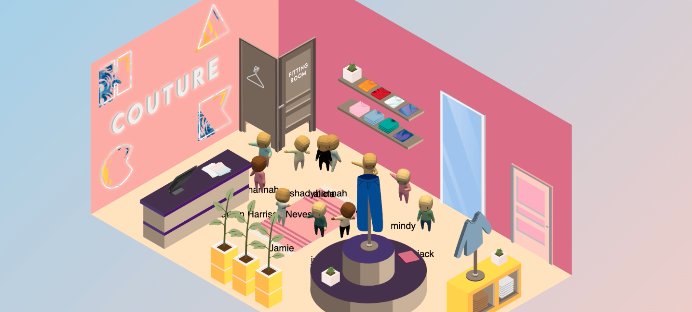

# playground

_Making the HackMIT Club Penguin 🐧 dream come true._

[](https://gitter.im/HackMIT/playground?utm_source=badge&utm_medium=badge&utm_campaign=pr-badge)



## Setup

Make sure you have Go installed. If you don't have Go installed, [click here](https://golang.org/doc/install). (If you're on macOS, I recommend using [Homebrew](https://brew.sh))

### Start the database

Make sure Docker is installed, and that the Docker daemon is running. Then, run the following command to start an ephemeral database in the background:

```
docker run -dp 6379:6379 --name playground-db redis:latest
```

### Set up secrets

You'll need our secrets file. If you want to use your own secrets, copy `.env.sample` to `.env` and paste yours in there. If you need to get the HackMIT ones, message Jack.

### Build

To build the project, just run the following command:

```
go build .
```

### Run

To run the project, you can then just run the binary:

```
./playground -reset
```

Use the `-reset` flag the first time you run Playground in order to reset the database to its initial state. After you do that once, you don't have to use the flag anymore, unless you want to wipe everything.

### Run the frontend project

Check out the [playground-frontend](https://github.com/hackmit/playground-frontend) repo for more details about how to set up the user-facing side of this project.

## Contributing

In the coming weeks, we'll be cleaning up the project to a point where it isn't nearly as embarrassing as it is now. If you find any bad coding practices (spoiler: you will), we apologize — much of this project was completed at the last minute. Once we have a chance to clean everything up, we should be ready to receive some contributions!

## FAQs

### Can I use this for my own event?

In the coming months, we plan to clean up this project and get it to a point where you can run an event by just adjusting some config files! This won't be ready for a little while though — stay tuned for more info.

### Why did you build your own virtual platform?

Building it was fun! Also, we didn't want to pay for one, and we didn't love the options that were available back in April, when we decided to take on the project.

### How can I deploy this?

We used AWS Elastic Beanstalk during HackMIT in order to handle the load from thousands of concurrently connected users — our project is set up to have multiple ingest servers running in parallel. We'll publish more details about this soon.

### I have another question!

Feel free to ask us on [Gitter](https://gitter.im/HackMIT/playground)! You can also email us at team@hackmit.org.

## License

Playground is available under the MIT license. See the LICENSE file for more details.

## Credits

This project wouldn't have been possible without our supportive and energetic team and the greater open source community.

### Dev team

- [Jack Cook](https://jackcook.com) (_HackMIT co-director, project lead_)
- [Julia Gonik](https://linkedin.com/in/julia-gonik-44813917a) (_Jukebox, workshop attendance_)
- [Natalie Huang](https://linkedin.com/in/natalie-huang-09bba6178) (_A billion last-minute fixes and improvements_)
- [Jianna Liu](https://linkedin.com/in/jianna-liu-90747413b) (_Character profiles_)
- [Kat Liu](https://linkedin.com/in/kaxili) (_Settings, Twitter integration_)
- [Mindy Long](https://mlong93.github.io) (_Chat, account creation, world map_)
- [Michael Lu](https://linkedin.com/in/michael-lee-lu) (_Hacker feedback_)
- [Zoë Marschner](http://zoemarschner.com) (_Three.js wizard 🧙‍♀️_)
- [Shirlyn Prabahar](https://github.com/pshirlyn) (_[Quill](https://github.com/techx/quill) SSO_)
- [Hillary Tamirepi](https://linkedin.com/in/hillary-tamirepi-937660175) (_Playground explorer_)
- [Allen Wang](http://web.mit.edu/awang23/www/) (_Sponsor panel, hacker queue_)
- [Eva Yi Xie](https://linkedin.com/in/eva-yi-xie1128) (_Pop-up designs_)

### Design team

- [Angela Zhang](https://www.linkedin.com/in/awzhang) (_HackMIT design lead_)
- [Soomin Chun](https://linkedin.com/in/soomin-chun-95889b173) (_Town square, nightclub, stadium_)
- [Sean Knight](https://knightsean00.github.io) (_Character selector, sponsor areas/buildings_)
- [Savannah Liu](https://linkedin.com/in/savannah-liu-291674197) (_Town square, character profiles, hacker arena_)
- [Gary Nguyen](https://linkedin.com/in/gary-nguyen-mit) (_Non-profit village_)
- [Aliza Rabinovitz](https://linkedin.com/in/alizarabinovitz) (_Settings, achievements, town square 2_)
- [Anna Sun](https://linkedin.com/in/annasun19) (_Chat, coffee shop, town square 2, stadium interior_)
- [Eva Yi Xie](https://linkedin.com/in/eva-yi-xie1128) (_Icons, pop-ups_)
- Jessica Xu (_Icons_)

### Resources

- [“Done For You” sound effect](https://notificationsounds.com/notification-sounds/done-for-you-612), Notification Sounds
- [“Beaver” 3D asset](https://poly.google.com/view/fwtA7VLrXPr), Poly by Google
- [Original character model](http://quaternius.com), Quaternius
- [Several icons](http://iconmonstr.com), iconmonstr
- [Many open source frameworks](https://github.com/hackmit/playground/blob/master/go.mod)
